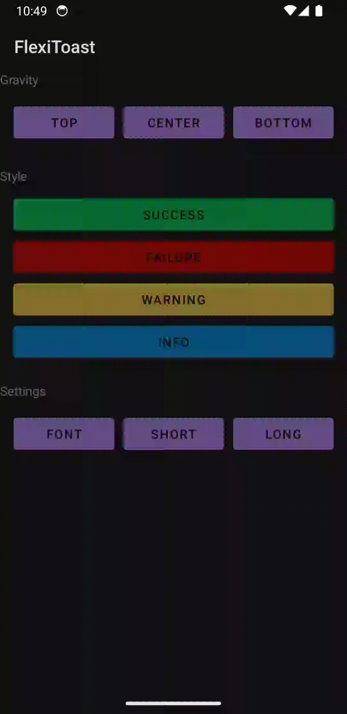
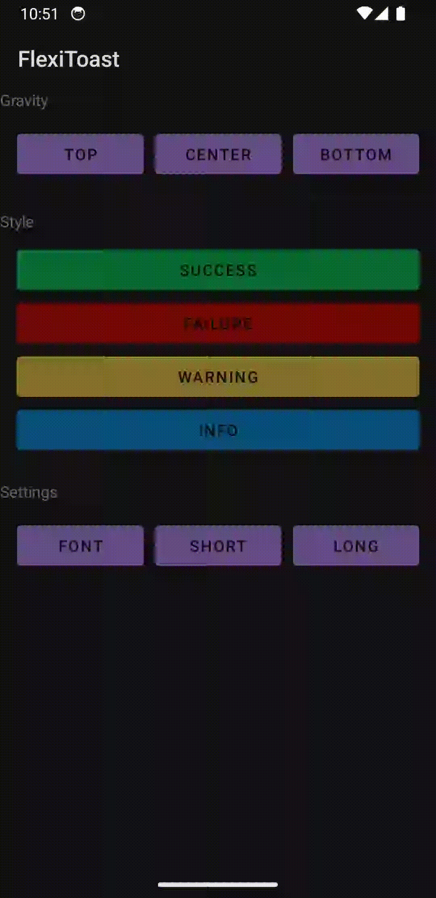
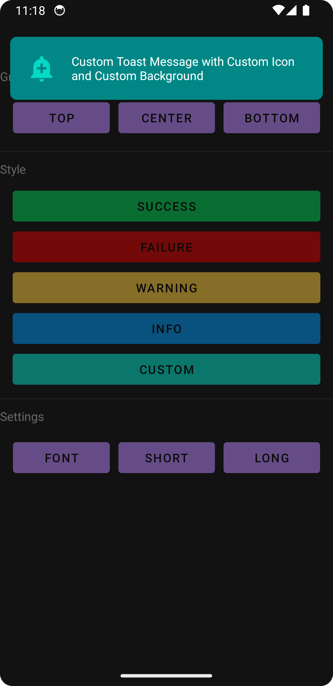
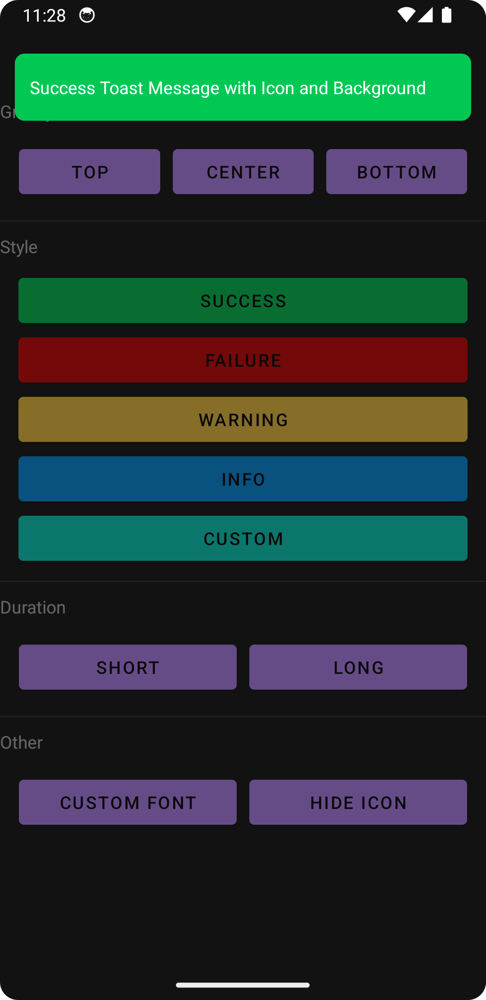

# FlexiToast
FlexiToast is a customizable toast notification library for Android. It allows developers to create stylish, flexible toasts with various options, such as custom fonts, icons, and background colors. Whether you need success messages, warnings, or error alerts, FlexiToast provides a simple and intuitive API to create the perfect toast for your app.

## Features
- Display customizable toasts with different styles (Success, Warning, Error, etc.).
- Support for Lottie animations or Android drawables as icons.
- Set custom fonts for toast messages.
- Flexible positioning with top, center, and bottom options.
- Ability to customize background colors, icon visibility, and more.

       

## Installation
Add the following to your project's `build.gradle`:

    dependencies {
        implementation 'com.github.Alomair91:FlexiToast:Tag'
    }

## Usage
### Basic Example
To display a simple success toast, use the following code:

    // Create a FlexiToast instance and display it
    FlexiToast(context, "This is a success message")
        .setStyle(FlexiToastStyle.SUCCESS)
        .show()

### Custom Toast with Lottie Animation or Drawable Icon
To display a custom toast with either a Lottie animation or drawable icon:

    // Set a custom icon with a Lottie animation
    FlexiToast(context, "Custom Toast with Lottie Animation")
        .setIcon(animationFile = "lottie/custom_icon.json")
        .show()
    
    // Or set a custom drawable as the icon
    FlexiToast(context, "Custom Toast with Drawable Icon")
        .setIcon(drawableResId = R.drawable.custom_icon)
        .show()

### Custom Background Color and Font
You can also change the background color and apply a custom font to the toast message:

    FlexiToast(context, "Custom Toast with Font and Background")
        .setBackground("#FF5733") // Set custom background color
        .setTextFont(R.font.custom_font) // Set custom font
        .show()

### Positioning Toast
You can position the toast at the top, center, or bottom of the screen:

    FlexiToast(context, "Toast at the Center")
        .setGravity(FlexiToastGravity.CENTER) // Set gravity to center
        .show()

### Setting Toast Duration
To control how long the toast is displayed (short or long):

    // Short length toast
    FlexiToast(context, "Short Toast").setDuration(Toast.LENGTH_SHORT).show()
    
    // Long length toast
    FlexiToast(context, "Long Toast").setDuration(Toast.LENGTH_LONG).show()

### Hiding Icon
You can hide the icon from the toast if needed:

    // Hide the icon from the toast
    FlexiToast(context, "Toast without Icon").hideIcon().show()

### Customizing Fonts
You can apply a custom font by either specifying the font path from the assets folder or using a font resource ID:

    // From assets
    FlexiToast(context, "Custom Font from Assets")
        .setTextFont("fonts/custom_font.ttf")
        .show()
    
    // From resources (res/font)
    FlexiToast(context, "Custom Font from Resources")
        .setTextFont(R.font.my_custom_font)
        .show()

## Available Styles
FlexiToast supports several predefined styles for convenience. The available styles are:

* SUCCESS: Green background with success animation.
* FAILURE: Red background with failure animation.
* WARNING: Yellow background with warning animation.
* INFO: Blue background with information animation.
* CUSTOM: Custom background and animation based on user configuration.

## License
This project is licensed under the MIT License. See the LICENSE file for more details.

___

## Example Project
You can find an example project in the `simple` folder of this repository to see how to integrate and use FlexiToast in your app.

___

## Contributing
Contributions are welcome! Feel free to open an issue or submit a pull request.

___

Enjoy using FlexiToast in your projects!
